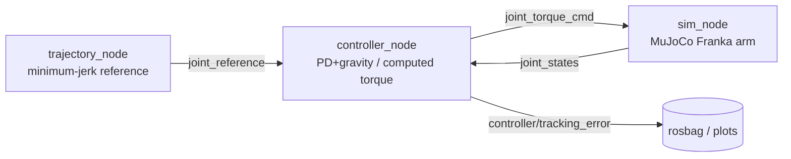
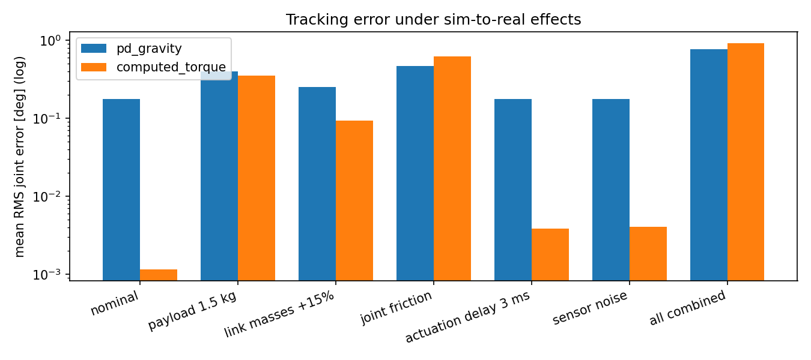

# ROS 2 torque control of a Franka arm in MuJoCo

A small ROS 2 control pipeline for a 7-DoF Franka arm simulated in MuJoCo: a simulation node acts
as the robot, a controller node computes joint torques at a fixed rate, and a trajectory node
publishes a minimum-jerk reference. The point of the project is the **sim-to-real gap**: the
controller only ever knows a nominal model, while the simulated robot can carry an unknown
payload, have heavier links, joint friction, actuation delay and noisy sensors.



| Topic | Type | Rate |
|---|---|---|
| `joint_states` | `sensor_msgs/JointState` | 500 Hz |
| `joint_reference` | `trajectory_msgs/JointTrajectoryPoint` | 500 Hz |
| `joint_torque_cmd` | `std_msgs/Float64MultiArray` (7 × Nm) | 500 Hz |
| `controller/tracking_error` | `std_msgs/Float64MultiArray` (7 × rad) | 500 Hz |

## What it contains

- **Two controllers**: PD with gravity compensation, and computed torque (feedback linearization)
  using the mass matrix and bias forces of the controller's own model copy.
- **A plant with switchable model errors**: payload, link mass scaling, viscous damping, Coulomb
  friction, actuation delay, sensor noise, plus Franka joint torque limits.
- **Loop diagnostics**: the controller reports its measured rate, jitter and worst-case period.
- **An offline experiment** that sweeps all effects for both controllers without ROS 2, so results
  are reproducible and fast.
- **Tests** for the trajectory generator and the closed loop.

## Setup (Ubuntu 24.04 + ROS 2 Jazzy)

```bash
# 1) MuJoCo and plotting (Ubuntu 24.04 needs the flag because of PEP 668)
python3 -m pip install --break-system-packages mujoco matplotlib

# 2) Franka model from MuJoCo Menagerie (sparse clone: only the Franka folder)
cd ~
git clone --depth 1 --filter=blob:none --sparse https://github.com/google-deepmind/mujoco_menagerie.git
cd mujoco_menagerie && git sparse-checkout set franka_emika_panda
echo 'export MENAGERIE_PATH=~/mujoco_menagerie' >> ~/.bashrc && source ~/.bashrc

# 3) Build the package
mkdir -p ~/ros2_ws/src && cd ~/ros2_ws/src
git clone <this-repo> && cd ~/ros2_ws
colcon build --packages-select franka_torque_control
source install/setup.bash
```

## Run

```bash
ros2 launch franka_torque_control pipeline.launch.py                       # computed torque
ros2 launch franka_torque_control pipeline.launch.py controller:=pd_gravity
ros2 launch franka_torque_control pipeline.launch.py use_viewer:=false     # headless
```

Useful checks while it runs:

```bash
ros2 topic hz /joint_torque_cmd            # is the loop really at 500 Hz?
ros2 topic echo /controller/tracking_error
ros2 bag record /joint_states /joint_reference /joint_torque_cmd /controller/tracking_error
```

The simulation node prints its real-time factor every 5 seconds. If it drops below ~1.0, the
physics is running slower than wall-clock time; lower `sim_rate_hz` or turn the viewer off.

## Sim-to-real experiments

Edit the `mujoco_sim` block in `config/params.yaml` (or pass `-p` overrides) to make the simulated
robot differ from the controller's model, for example:

```yaml
payload_kg: 1.5
link_mass_scale: 1.15
friction_torque: 0.5
actuation_delay_s: 0.003
sensor_noise_pos: 0.0005
sensor_noise_vel: 0.005
```

To compare all effects for both controllers in one go (no ROS 2 needed, ~1 minute):

```bash
python3 scripts/offline_experiment.py --duration 15
```

It writes `results/results.csv`, `results/results.md` and `results/tracking_error.png`.

## Tests

```bash
cd ~/ros2_ws && colcon test --packages-select franka_torque_control && colcon test-result --verbose
# or directly:
cd franka_torque_control && python3 -m pytest test
```

## Results

Measured on Ubuntu 24.04 (WSL2 on Windows 11), ROS 2 Jazzy, MuJoCo 3.13.

**ROS 2 pipeline**, 500 Hz target, physics at 1 kHz:

| Configuration | Loop rate | Jitter | Worst period | Real-time factor | max abs error |
|---|---|---|---|---|---|
| headless (`use_viewer:=false`) | 500.0 Hz | 0.05-0.08 ms | 2.2-3.6 ms | 0.92-1.00 | < 0.005 deg |
| with MuJoCo viewer | 472-500 Hz | 0.08-0.83 ms | 9.2 ms | 0.86-0.93 | spikes to 1.8 deg |

Rendering costs enough time to push the simulation below real time. Since the reference is
generated on wall time, the robot then lags it and transient errors appear. Publishing `/clock`
(see Next steps) would remove this coupling.

**Tracking accuracy**, offline experiment, 15 s per run, physics 1 kHz, control 500 Hz:

| Scenario | PD + gravity: RMS / max [deg] | Computed torque: RMS / max [deg] |
|---|---|---|
| nominal | 0.176 / 1.152 | 0.001 / 0.005 |
| payload 1.5 kg | 0.403 / 1.381 | 0.352 / 1.176 |
| link masses +15% | 0.251 / 1.153 | 0.094 / 0.474 |
| joint friction | 0.471 / 3.816 | 0.620 / 3.690 |
| actuation delay 3 ms | 0.176 / 1.152 | 0.004 / 0.062 |
| sensor noise | 0.177 / 1.148 | 0.004 / 0.016 |
| all combined | 0.770 / 3.846 | 0.924 / 3.743 |



With an exact model, computed torque tracks about 170x more accurately than PD with gravity
compensation. Unmodelled Coulomb friction is the one case where PD wins: friction is not
cancelled by feedback linearization, and the effective stiffness of computed torque on the light
distal joints is below the stiff PD gains used there.

## Things worth being able to explain

1. Why computed torque is nearly exact with a perfect model, and what happens to that advantage as
   the model gets worse.
2. Why unmodelled Coulomb friction hurts a model-based controller more than a stiff PD law on the
   distal joints, where the inertia is small.
3. Why the controller subtracts `qfrc_passive` from `qfrc_bias` (the model's own joint damping).
4. What actuation delay does to phase margin, and why the effect grows with feedback gain.
5. Why the controller runs at 500 Hz while the physics runs at 1 kHz, and what zero-order hold
   means for stability.
6. Why Franka's distal joints are limited to 12 Nm, and where the torque limits bite first.

## Next steps

- Publish `/clock` from the simulation and run the other nodes with `use_sim_time`, so the
  reference follows simulated time instead of wall time.
- Port the controller node to C++ (`rclcpp`), or wrap it as a `ros2_control` controller.
- Add Cartesian impedance control on top of the same torque interface.
- Visualize the arm in RViz with `robot_state_publisher` and the Franka URDF.

## License

MIT, see [LICENSE](LICENSE).
